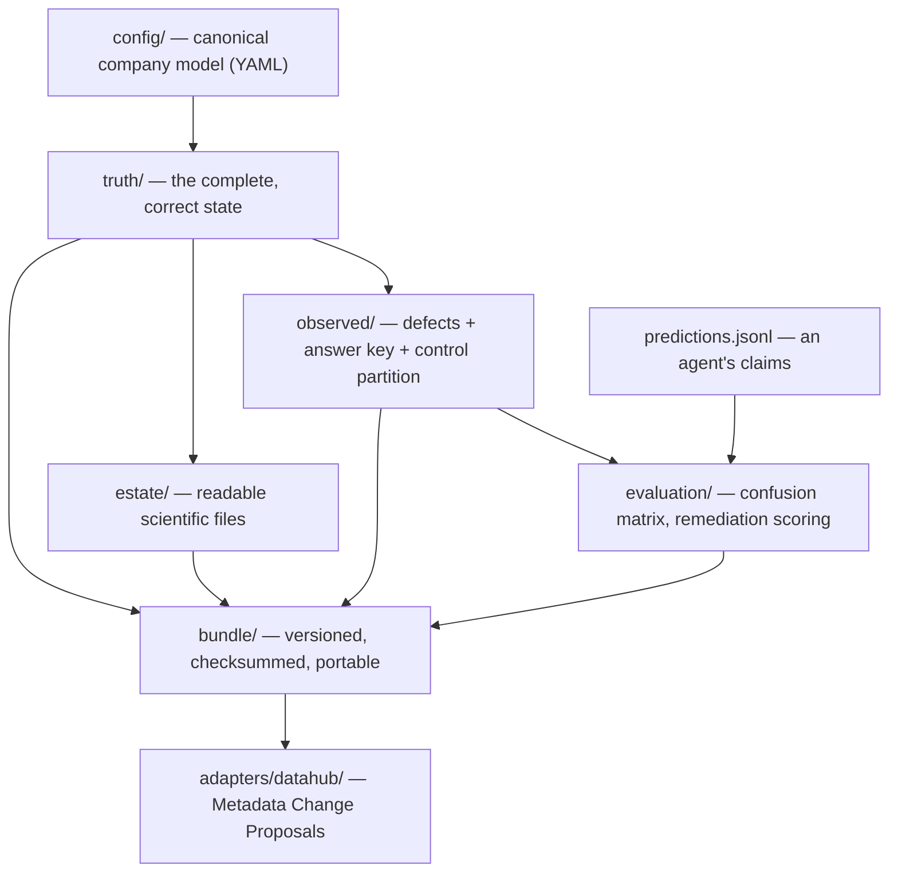

# Data Swamp Biosystems

> **A deterministic synthetic biotech data estate and governance benchmark — for testing data catalogues, governance controls, lineage systems and AI agents without proprietary, confidential or patient data.**

[](https://github.com/ronfinn/dataswamp-biosystems/actions/workflows/ci.yml)
[](https://www.python.org/)
[](LICENSE)


Data Swamp Biosystems generates a complete, entirely fictional oncology research
data estate — programmes, studies, subjects, biospecimens, assays, pipeline runs,
files, datasets, data products, ownership, governance and lineage — then derives
a deliberately *imperfect* view of it by injecting a curated taxonomy of
governance defects. Because it knows exactly which defects it injected and which
entities it deliberately left clean, it can score a catalogue, a governance
control or an AI agent on what it found, what it missed, what it wrongly flagged
and what it proposed to do about it. Everything is seeded and deterministic: the
same configuration and seed produce byte-identical output.

## The problem it solves

Realistic scientific data estates are proprietary, confidential, spread across
systems, inconsistently documented and hard to reproduce outside production. So
tools that are supposed to *find problems* in such estates — catalogues,
data-quality suites, governance agents — are usually demonstrated on data with
no known problems in it, and "it found some issues" is accepted as evidence.

This project supplies the missing half: a realistic estate **with a published
answer key**. Every defect has an expected finding and an expected remediation,
every clean entity is named in a control partition, and every rule declares the
population it applies to — so precision, recall and specificity mean something
and cannot be inflated by counting entities a rule never applied to.

## Capabilities

| Capability | Command | Docs |
| --- | --- | --- |
| Canonical fictional company model | `validate-config` | [domain-model.md](docs/domain-model.md) |
| Deterministic truth graph | `generate-truth` / `validate-truth` | [truth-graph-schema.md](docs/truth-graph-schema.md) |
| Readable scientific file estate | `generate-files` / `validate-files` | [file-generation.md](docs/file-generation.md) |
| Defect injection + control partition | `inject-defects` / `validate-observed` | [observed-state.md](docs/observed-state.md) |
| Scoring an agent's predictions | `evaluate` | [evaluation.md](docs/evaluation.md) |
| Portable, checksummed bundles | `build-bundle` / `verify-bundle` | [bundles.md](docs/bundles.md) |
| DataHub metadata export (offline) | `export-datahub` | [datahub.md](docs/datahub.md) |
| Reference baseline agents | `run-baseline` / `list-baselines` | [baselines.md](docs/baselines.md) |
| The whole workflow, end to end | `demo` | below |

41 defect rules across 12 categories, six maturity profiles, and a fixed
canonical scenario pinned by committed golden digests.

## Installation

Requires Python 3.12 or 3.13.

**Not on PyPI yet** — this is a release candidate and nothing has been
published. Install from a checkout, using [uv](https://docs.astral.sh/uv/):

```bash
git clone https://github.com/ronfinn/dataswamp-biosystems.git
cd dataswamp-biosystems
uv sync
uv run dataswamp --help
```

Or build a distribution and install it anywhere:

```bash
uv build
pip install dist/dataswamp_biosystems-*.whl
dataswamp --help
```

The canonical configuration and the example submissions ship *inside* the
distribution, so an installed package needs no checkout to generate a benchmark.

## Five-minute quick start

One command runs the entire workflow into a single directory — generation,
scoring, bundling, verification and metadata export. It needs no seed, no
credentials and no network, and takes a couple of seconds:

```bash
dataswamp demo --output-dir ./dataswamp-demo
```

```text
[1/5] Generating the canonical scenario into dataswamp-demo/generated ...
[2/5] Scoring .../examples/predictions/partial.jsonl ...
[3/5] Packaging a bundle into dataswamp-demo/bundle ...
[4/5] Verifying the bundle ...
[5/5] Exporting observed DataHub metadata into dataswamp-demo/export/datahub ...

Demo complete. Output:
  truth graph        dataswamp-demo/generated/truth
  file estate        dataswamp-demo/generated/estate
  observed state     dataswamp-demo/generated/observed
  evaluation report  dataswamp-demo/generated/evaluation/evaluation-report.md
  benchmark bundle   dataswamp-demo/bundle
  DataHub metadata   dataswamp-demo/export/datahub

Scored submission: .../examples/predictions/partial.jsonl
  TP 4  FP 0  FN 173  TN 6944
  precision 1.0000  recall 0.0226  specificity 1.0000  F1 0.0442
  reserved-control false positives: 0
  unsafe remediations: 0
```

Running it twice into different directories produces byte-identical output.

### The same thing, one step at a time

```bash
dataswamp validate-config
dataswamp generate-truth   --seed 20260717 --output-dir generated/truth
dataswamp generate-files   --seed 20260717 --profile tiny --output-dir generated/estate
dataswamp inject-defects   --truth generated/truth --seed 20260717 --profile demo \
                           --output-dir generated/observed
dataswamp evaluate         --observed-dir generated/observed \
                           --predictions examples/predictions/partial.jsonl \
                           --output-dir generated/evaluation
dataswamp build-bundle     --output-dir dist/benchmark --release v0.1.0rc1
dataswamp verify-bundle    dist/benchmark
dataswamp export-datahub   --bundle dist/benchmark --mode observed --output-dir export/datahub
```

Run a reference baseline against the same benchmark and score it in one step:

```bash
dataswamp list-baselines
dataswamp run-baseline --agent rule-based --observed-dir generated/observed \
                       --output predictions.jsonl --evaluate
```

Every generating command refuses an output directory that is, contains or sits
inside one of its inputs, and refuses a non-empty directory without `--force`.

## Architecture



The five generation layers and the bundle packager are **catalogue-independent**:
they know nothing about DataHub or any other consumer. The adapter depends on
them, never the reverse, and takes no catalogue client as a dependency — a rule
enforced by a test. The observed layer never mutates the truth graph; the
evaluator mutates nothing at all; the bundler copies emitted bytes verbatim.

## Example evaluation results

Three example submissions ship with the project (see
[examples/](examples/README.md)), scored against the canonical `demo` scenario —
7 121 evaluated `(entity, rule)` pairs, 177 of them positive:

| Submission | TP | FP | FN | Precision | Recall | Specificity | Unsafe remediations |
| --- | ---: | ---: | ---: | ---: | ---: | ---: | ---: |
| `perfect.jsonl` | 177 | 0 | 0 | 1.0000 | 1.0000 | 1.0000 | 0 |
| `partial.jsonl` | 4 | 0 | 173 | 1.0000 | 0.0226 | 1.0000 | 0 |
| `unsafe.jsonl` | 1 | 4 | 176 | 0.2000 | 0.0056 | 0.9994 | 4 |

The `unsafe` submission is the point of the control partition: it flags clean
entities and proposes automatic fixes where the contract requires a human
decision, and the report says so separately rather than burying it in an
aggregate score.

## Reference baseline scores

Three baseline agents ship with the benchmark so a result has something to be
compared against. Each reads `observed-graph.json` and nothing else — never the
expected findings, the controls or the rule scope — and each is short enough to
read in full. **They are not production-quality governance agents.** Scored
against the same canonical `demo` scenario:

| Baseline | Predictions | Precision | Recall | Specificity | F1 | Reserved-control FPs | Remediation end-to-end |
| --- | ---: | ---: | ---: | ---: | ---: | ---: | ---: |
| `null` | 0 | n/a | 0.0000 | 1.0000 | 0.0000 | 0 | 0.0000 |
| `naive-metadata` | 65 | 0.9077 | 0.3333 | 0.9991 | 0.4876 | 0 | 0.0000 |
| `rule-based` | 92 | 1.0000 | 0.5198 | 1.0000 | 0.6840 | 0 | 0.5198 |

Broken out by **difficulty tier** — how much evidence a detector must relate
before it can decide, which is not severity and not the maturity profile:

| Baseline | bronze F1 | silver F1 | gold F1 |
| --- | ---: | ---: | ---: |
| `null` | 0.0000 | 0.0000 | 0.0000 |
| `naive-metadata` | 0.9138 | 0.0000 | 0.3636 |
| `rule-based` | 0.9839 | 0.7438 | 0.0000 |

Performance is not monotonic in tier and is reported as measured: the rule-based
agent scores zero at gold because none of the rules it re-implements is a
cross-asset or peer-relative one, and the naive agent's gold showing is shallow
signals coinciding with peer-relative rules rather than reasoning. See
[docs/difficulty-tiers.md](docs/difficulty-tiers.md).

And on the **adversarial** tier — constructed cases where a clean near-miss
control sits beside the real defect (19 scored pairs: 13 positive, 6 near-miss
negatives):

| Baseline | TP | FP | Precision | Recall | F1 | Near-miss FPs |
| --- | ---: | ---: | ---: | ---: | ---: | ---: |
| `null` | 0 | 0 | n/a | 0.0000 | 0.0000 | 0 |
| `naive-metadata` | 2 | 2 | 0.5000 | 0.1538 | 0.2353 | **2** |
| `rule-based` | 7 | 0 | 1.0000 | 0.5385 | 0.7000 | 0 |

The naive agent is fooled by a third of the lookalikes it can see; the
rule-based agent resists all of them and still fails half the tier. Two case
classes — cross-asset inconsistency and no-remediation — defeat all three, which
is recorded rather than hidden. See
[docs/adversarial-scenarios.md](docs/adversarial-scenarios.md).

The null baseline's precision is `null`, not `0.0`: it predicted nothing, so the
denominator is empty and the quantity was never measured. The rule-based agent
implements 20 of the 41 rules; the 21 it cannot reach from observed metadata are
listed — with reasons — in [docs/baselines.md](docs/baselines.md), which also
records two rules that turned out to be under-specified from observed metadata
alone. Scores are comparable only within one generator version, config
fingerprint, profile and seed.

## Guarantees and limitations

**Reproducibility.** The same configuration, generator version and seed produce
byte-identical output. Across the whole declared dependency range, the truth
graph and the observed-state ledgers are byte-identical; the materialized
scientific files are byte-identical only within one *environment fingerprint*,
because their binary payloads are written by pyarrow, Pillow, tifffile and
anndata, which change output between releases. This is stated per-artefact
rather than claimed globally — see [reproducibility.md](docs/reproducibility.md).

**Honest metrics.** Undefined metrics are reported as `null` with their
numerator and denominator, never as `0.0`. A rule's denominator is its declared
population; a prediction against an entity outside it is reported as an
out-of-scope false positive rather than folded into the matrix.

**Current limitations.**

* Scale is modest by design (180 catalogue assets, ~1 800 lineage edges); it is a
  correctness benchmark, not a load test.
* One estate shape and one defect taxonomy. All four difficulty tiers ship, but
  the adversarial set is a focused initial six case classes over a small
  constructed universe — not a model of real-world ambiguity.
* The published baselines are deliberately simple and metadata-only; none opens a
  materialized scientific file, and no LLM-backed agent ships.
* DataHub export is offline file emission; live ingestion is not implemented.
* No run-to-run comparison or regression reporting yet.

See [docs/roadmap.md](docs/roadmap.md) for what is planned, and
[docs/public-api.md](docs/public-api.md) for which interfaces are stable.

## Security and synthetic data

Every person, institution, study, dataset and identifier in this project is
fictional and synthetically generated. Fictional identities use the
`dataswamp.example` domain. The project contains no patient data, personal data,
employer or partner data, proprietary datasets, confidential scientific
information, or production schemas copied from any real organisation. Any
resemblance to a real organisation, person, programme or study is unintended.

Generation is offline: no command in the documented workflow requires a network,
a credential or a server, and the DataHub recipe reads credentials from
environment variables rather than embedding them. Provenance records the
dependency and platform identity needed to interpret a reproducibility claim,
and deliberately records no hostname, username, path or wall-clock time.

To report a vulnerability, see [SECURITY.md](SECURITY.md).

## Licensing

The **source code** in this repository is released under the
[MIT License](LICENSE).

The licence for **generated benchmark data** has not yet been separately
designated. This is an open decision, deliberately not pre-empted here: bundles
declare `generated_data_license: not-separately-defined` and carry a `LICENSES.md`
stating the position, which is the file a bundle consumer should consult. See
[docs/generated-data-licensing-decision.md](docs/generated-data-licensing-decision.md)
for exactly what remains to be decided and which files change once it is.

No real patient, biological, company-confidential or third-party licensed dataset
is included in, or required by, this project.

## Project status

**v0.1 release candidate.** The end-to-end benchmark workflow is complete and
tested; the interfaces listed in [docs/public-api.md](docs/public-api.md) are the
ones intended to be stable at v0.1. No GitHub Release or version tag has been
published yet. The package version is `0.1.0rc1`.

## Documentation

| Document | What it covers |
| --- | --- |
| [docs/domain-model.md](docs/domain-model.md) | The canonical company model and its config schema |
| [docs/truth-graph-schema.md](docs/truth-graph-schema.md) | Truth-graph entities, shards and invariants |
| [docs/file-generation.md](docs/file-generation.md) | Scientific file formats, profiles and placeholders |
| [docs/observed-state.md](docs/observed-state.md) | Defect taxonomy, ledgers, profiles, control partition |
| [docs/evaluation.md](docs/evaluation.md) | The prediction contract and the scoring semantics |
| [docs/baselines.md](docs/baselines.md) | The reference baseline agents, their permitted reads and canonical scores |
| [docs/difficulty-tiers.md](docs/difficulty-tiers.md) | Bronze/silver/gold, reasoning scopes, tier generation and per-tier scoring |
| [docs/adversarial-scenarios.md](docs/adversarial-scenarios.md) | The adversarial tier: constructed cases, near-miss controls, the privilege boundary |
| [docs/bundles.md](docs/bundles.md) | Bundle layout, manifest, verification, reader API |
| [docs/datahub.md](docs/datahub.md) | URNs, entity/aspect mapping, the privilege boundary |
| [docs/public-api.md](docs/public-api.md) | Stable vs experimental vs internal interfaces |
| [docs/reproducibility.md](docs/reproducibility.md) | Determinism scopes and the golden-digest contract |
| [docs/release-checklist.md](docs/release-checklist.md) | The exact commands run before a release |
| [docs/roadmap.md](docs/roadmap.md) | Scope, design principles, roadmap, non-goals |
| [examples/README.md](examples/README.md) | Example submissions and how each is scored |
| [CONTRIBUTING.md](CONTRIBUTING.md) | Development setup and common contributor tasks |
| [CHANGELOG.md](CHANGELOG.md) | What changed, by release |

## Contributing

Contributions, discussions, bug reports and feature proposals are welcome — see
[CONTRIBUTING.md](CONTRIBUTING.md) for setup, the quality gates, and how to add a
defect rule or a schema field.

## Author

Created and maintained by [Ron Finn](https://github.com/ronfinn).

Inspired by how hard it is to develop scientific data platforms, catalogues,
governance systems and AI tooling when safe, realistic development data does not
exist.
